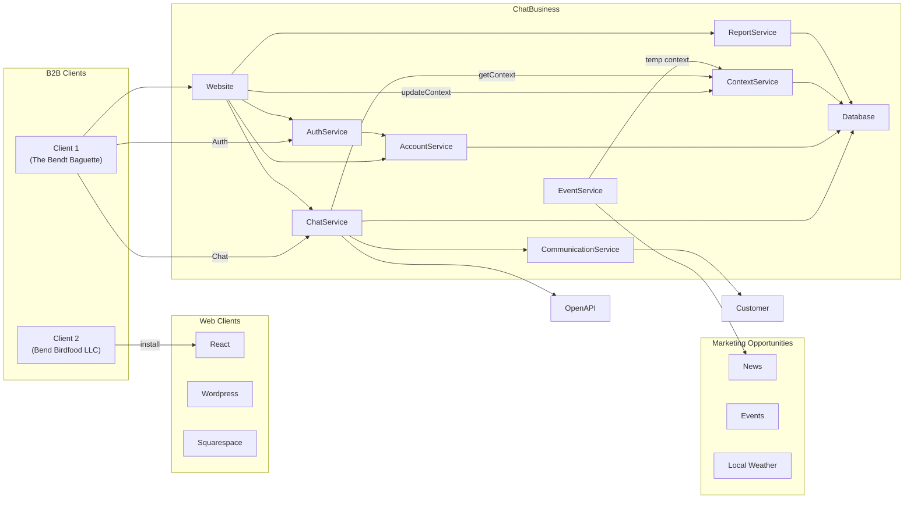

# Advanced B2B OpenAI System Design

A more advanced system design could offer additional features including:

- friendly UI to manage the website's location, hours, and products
- monthly reports showing common questions, words, or busy times
- temporary chat context from local events

## Web Clients
These would essentially be wrappers or thin clients to make it easy to use our API.  Clients would sign up on our website and create an API key to use in their client of choice (react, wordpress, etc) to get a default, functional chat window that responds with peronalized business information.

The selling point is that it's probably easier and cheaper to pay for our chat widget, than creating their own.

## Website
Clients could use our website to create and update their account, including defining chat usage limits, context like warmth or tone, adjust their business hours, products, etc.

They could manage their API keys, which could be locked to specific hosts to prevent leaked eys from being used elsehwere.

Offering an API would support updating their products in real time.

## AccountService
Manages account details like name, business contact, or billing.

## AuthService
Supports authenticating JWT or API keys.

## ChatService
Authenticates, validates, and adds the client context to chat messages, before calling openAI.

This is our chance to add value compared to the client using openAI instead.

## ContextService
Manages the chat context used by openAI.

In the quick-and-dirty POC this was done by sending context with each chat message, but it could also be done by creating a unique agent for each client, using file search, and using the openAI API to update their context files.  (This would support larger contexts and useful for clients with lots of products.)

It could make sense to create and store context files somewhere like S3, which could also support clients who want to perform batch updates using raw files.

## CommunicationService
Manages client communications including sending email, SNS, or any functions they want us to call when a customer asks for personal attention.

## EventService
Monitors news, events, or weather to provide local context relevant to the client's business.  If they sell umbrellas, we can remind visitors there's a chance of rain this weekend.

This could be an event-driven system and achieved by polling daily for a set of keywords, and updating contextService.

## ReportService
Builds internal and client activity reports from a combination of data sources including internal databases, and openAI.
