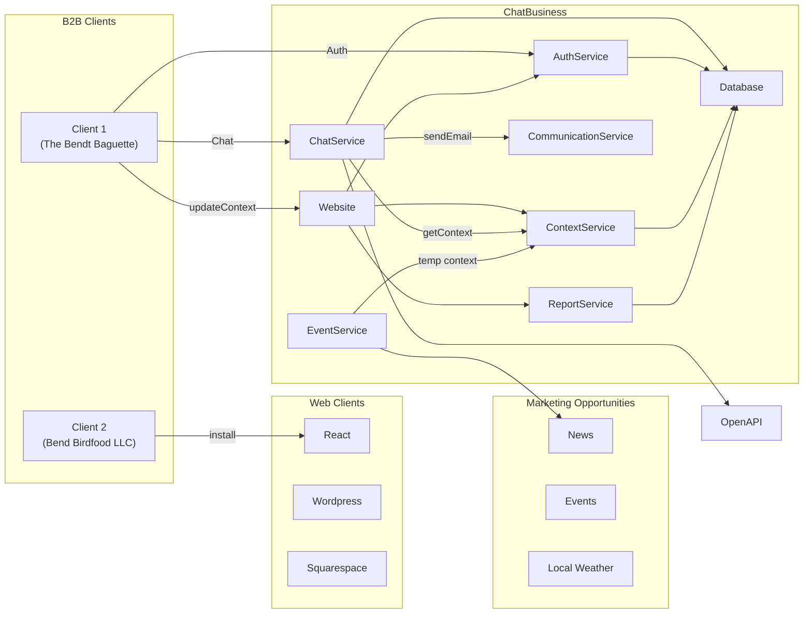

# Advanced B2B OpenAI System Design

An advanced system design could offer additional features including:

- friendly UI to manage the website's location, hours, and products
- reports to show 

```mermaid
flowchart LR
    openApi["OpenAPI"]

    subgraph Marketing Opportunities
        news["News"]
        events["Events"]
        weather["Local Weather"]
    end

    subgraph Web Clients
        client-react["React"]
        client-wordpress["Wordpress"]
        client-squarespace["Squarespace"]
    end

    subgraph B2B Clients
        client1["Client 1<br/>(The Bendt Baguette)"]
        client2["Client 2<br/>(Bend Birdfood LLC)"]
    end

    subgraph ChatBusiness
        frontend["Website"]
        authService["AuthService"]
        chatService["ChatService"]
        contextService["ContextService"]
        communicationService["CommunicationService"]
        eventService["EventService"]
        reportService["ReportService"]
        database["Database"]
    end

    client1 -- "Chat" --> chatService
    client1 -- "Auth" --> authService
    client1 -- "updateContext" --> frontend
    client2 -- "install" --> client-react

    frontend --> authService
    frontend --> contextService
    frontend --> reportService

    chatService -- "getContext" --> contextService
    chatService -- "sendEmail" --> communicationService
    chatService --> database
    chatService ---> openApi

    authService --> database
    contextService --> database
    reportService --> database

    eventService --> news
    eventService -- "temp context" --> contextService
```